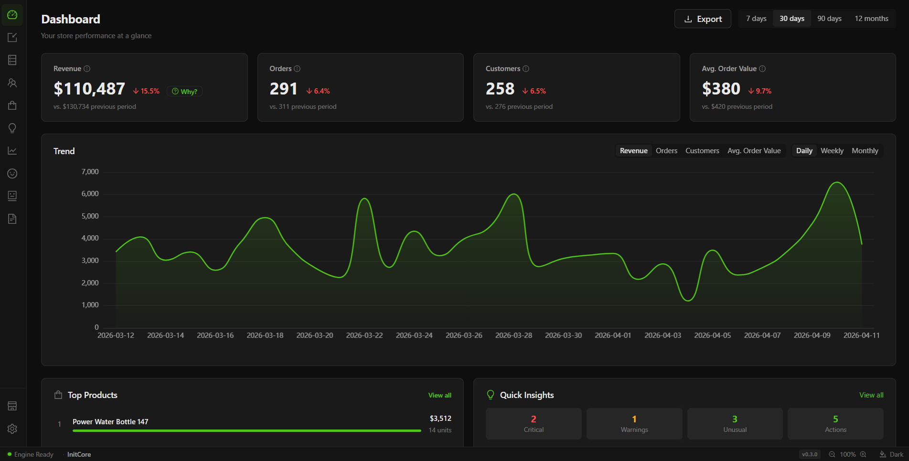
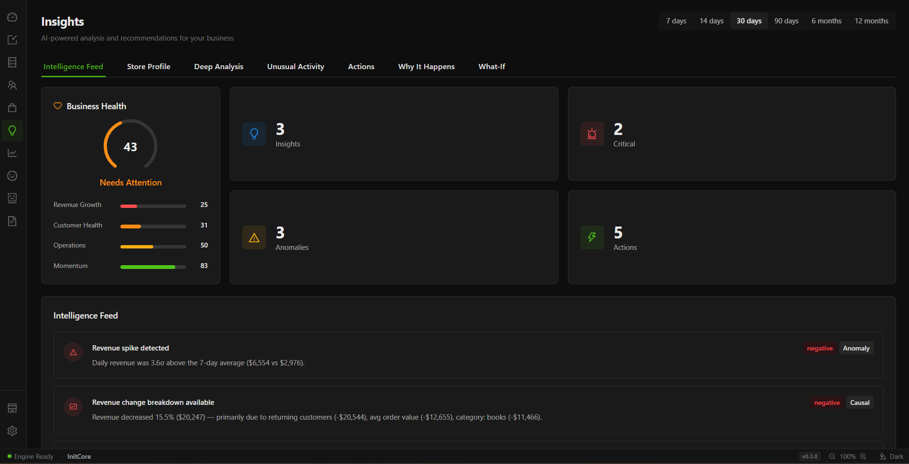
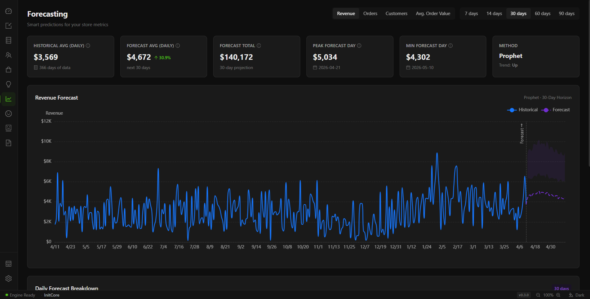
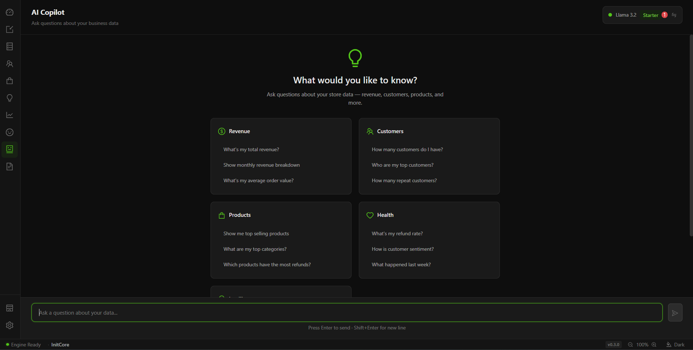

# NOVEM — E-Commerce Intelligence Platform

A local-first desktop app that turns e-commerce exports (CSV, Excel, Google Sheets, Shopify, PostgreSQL) into KPIs, customer segments, forecasts and plain-language insights. Everything — the database, the models, the LLM — runs on your own machine. Nothing is uploaded anywhere.

| | |
|---|---|
| <br>**Dashboard** — revenue, orders, customers and AOV against the previous period, with a trend chart and top products. | <br>**Insights** — business health score, anomaly detection, and a feed of generated findings with causal breakdowns. |
| <br>**Forecasting** — Prophet projections for revenue, orders, customers and AOV with confidence bands. | <br>**AI Copilot** — natural-language questions answered from your own data by a local Ollama model. |

---

## Why this exists

Small store owners sit somewhere awkward. The analytics built into Shopify or WooCommerce stop at "revenue went down". Enterprise BI is priced for teams that already have an analyst. Open-source data tooling assumes you can write SQL and stand up a warehouse. So decisions about stock, pricing and ad spend often get made from a spreadsheet export and a hunch.

NOVEM aims at the middle: point it at the exports you already have, and it does the profiling, segmentation, modelling and explaining for you — offline, on a laptop, with no account and no subscription.

## How it works

The app is a Tauri (Rust) shell wrapping two things: a React frontend and a Python analytics engine that runs as a local HTTP server on `127.0.0.1:44945`.

```
┌─────────────────────────────────────────────┐
│  Tauri shell (Rust)                         │
│  · owns the window, starts/stops the engine │
│  ┌───────────────────────────────────────┐  │
│  │  React 19 + TypeScript + Ant Design    │  │
│  │  ECharts · Zustand · React Router      │  │
│  └──────────────┬────────────────────────┘  │
└─────────────────┼───────────────────────────┘
                  │  HTTP (localhost only)
┌─────────────────▼───────────────────────────┐
│  FastAPI engine (Python)                    │
│  23 routers · ~170 endpoints                │
│  ┌─────────────┐      ┌──────────────────┐  │
│  │  DuckDB     │      │  SQLite          │  │
│  │  analytical │      │  settings,       │  │
│  │  tables     │      │  imports, auth   │  │
│  └─────────────┘      └──────────────────┘  │
└─────────────────────────────────────────────┘
```

In development the two halves run as separate processes — `concurrently` starts uvicorn and Vite. In a release build the engine is frozen with PyInstaller and shipped inside the installer; the Rust shell launches it as a child process on startup, waits for the port to accept connections, and asks it to shut down gracefully on exit.

Analytical data lives in DuckDB (`analytics.duckdb`) — orders, customers, products, ad spend, reviews, stock levels — all scoped by `store_id`, so multiple stores stay isolated. Everything else lives in SQLite: settings, import history and lineage, alerts, sessions, encrypted connector credentials, sync schedules.

## What's in it

| Module | What it does |
|---|---|
| **Dashboard** | Revenue / orders / customers / AOV vs. the previous period, daily–weekly–monthly trend, top products, quick insight counts, CSV export |
| **Customers** | RFM segmentation (Champions → Lost), churn risk and CLV via BG/NBD + Gamma-Gamma (`lifetimes`), cohort retention, per-customer story timelines |
| **Products** | Category and product revenue breakdowns, market-basket association rules (Apriori via `mlxtend`), lifecycle classification, stock forecasting and stockout analysis |
| **Marketing** | Channel ROI, ad-spend correlation, campaign ranking, wasted-spend detection |
| **Insights** | Findings ranked by impact, z-score anomaly detection, revenue decomposition ("revenue fell 15.5% — returning customers −$20.5k, AOV −$12.7k"), business health score, SHAP explanations, what-if simulation |
| **Forecasting** | Prophet time-series forecasts for revenue, orders, customers and AOV, with a linear-trend fallback when Prophet is unavailable |
| **Reviews / Sentiment** | Review scoring and rating breakdown, sentiment over time, keyword and aspect extraction |
| **AI Copilot** | RAG over a cached store context, answered by a local Ollama model (Llama 3.2, Phi-3 Mini, Qwen 2.5 7B/14B); rule-based answers when Ollama is not running |
| **Import** | CSV/TSV/Excel upload with schema auto-detection and column mapping, Google Sheets by public URL, Shopify Admin API, PostgreSQL (table or read-only query), plus a generated sample dataset |
| **Data Viewer** | Browse and search the raw DuckDB tables with pagination and CSV export |
| **Reports** | Narrative report builder, CSV bundles, PDF generation via ReportLab |
| **Stores & Settings** | Multiple stores per install, currency handling with live exchange rates, scheduled syncs, email alerts, industry benchmarks |

Imports run through a pipeline before they land: file parsing → schema detection → column mapping → cleaning and channel normalisation → PII masking → quality scoring → merge. Customer emails and names are SHA-256 hashed on import by default, which is why the Data Viewer shows `customer_email_hash` rather than an address.

## Getting started

**Prerequisites:** Node.js 18+, pnpm, Python 3.11 or 3.12, Rust 1.77+. Ollama is optional and only needed for the Copilot.

```bash
git clone https://github.com/hamzakhan0712/Novem---E-Commerce-Intelligence-Platform.git
cd Novem---E-Commerce-Intelligence-Platform
```

Set up the engine:

```powershell
cd engine
python -m venv .venv
.venv\Scripts\Activate.ps1      # macOS/Linux: source .venv/bin/activate
pip install -r requirements.txt
```

Then run the whole app:

```bash
cd ../desktop
pnpm install
pnpm start                      # tauri dev — starts the engine, Vite, and the window
```

If you would rather drive the two halves yourself: `pnpm dev:engine` starts uvicorn on port 44945 with reload, `pnpm dev` starts Vite on port 1420, and `pnpm dev:all` runs both without the Tauri window.

There is no data on first launch. The quickest way in is **Import Data → Sample Data**, which generates a demo store you can click through before pointing NOVEM at your own exports.

## Building the installer

```powershell
.\scripts\build-installer.ps1
```

This checks prerequisites, generates the NSIS branding bitmaps, freezes the engine with PyInstaller, builds the frontend and the Rust shell, and bundles an NSIS installer into `desktop/src-tauri/target/release/bundle/nsis/`. Pass `-SkipEngine` when only the frontend or Rust side changed.

## Tests

```bash
cd engine  && pytest tests/ -q      # service tests + integration
cd desktop && pnpm test             # vitest, store-level tests
```

CI (`.github/workflows/ci.yml`) runs Ruff lint and format checks plus pytest on Python 3.11 and 3.12, then `tsc --noEmit`, ESLint with `--max-warnings 0`, vitest, and a production frontend build.

## Project layout

```
desktop/                 React + Tauri app
  src/
    pages/               17 route-level pages
    components/          99 components across 12 module folders
    stores/              Zustand stores, one per module
    hooks/               16 data-fetching hooks (data/loading/error/refetch)
    utils/ constants/    API client, formatting, shared constants
  src-tauri/             Rust shell — window, splash, engine lifecycle
engine/                  FastAPI analytics engine
  app/
    api/                 23 routers
    core/                DuckDB/SQLite setup, auth middleware, encryption,
                         rate limiting, APScheduler
    services/            18 service packages (dashboard, customers, products,
                         marketing, insights, forecasting, sentiment, copilot,
                         ingestion, connectors, alerts, export, …)
  tests/
scripts/                 Installer and asset build scripts (PowerShell)
docs/                    Architecture, API, data model, setup, deployment
```

## Documentation

| Document | Covers |
|---|---|
| [ARCHITECTURE.md](docs/ARCHITECTURE.md) | Layer boundaries, process model, data flow |
| [SETUP.md](docs/SETUP.md) | Step-by-step development environment setup |
| [FEATURES.md](docs/FEATURES.md) | Each feature in detail |
| [API-REFERENCE.md](docs/API-REFERENCE.md) | Endpoints, parameters, responses |
| [ENGINE-GUIDE.md](docs/ENGINE-GUIDE.md) | Services, models, ingestion pipeline |
| [FRONTEND-GUIDE.md](docs/FRONTEND-GUIDE.md) | Components, stores, hooks, conventions |
| [DATA-MODEL.md](docs/DATA-MODEL.md) | DuckDB and SQLite schemas |
| [DEPLOYMENT.md](docs/DEPLOYMENT.md) | Build pipeline and packaging |

## Status and limitations

A personal project, currently at version 1.0.0 of the desktop app and 0.3.0 of the engine. Worth knowing before you dig in:

- **Packaging is Windows-only.** The Tauri bundle targets NSIS and the build scripts are PowerShell. The engine and frontend are not themselves Windows-specific, but there is no macOS or Linux installer.
- **Live connectors cover Shopify and PostgreSQL.** Everything else comes in through CSV/Excel export or Google Sheets.
- **Some capabilities degrade rather than fail.** Forecasting falls back to linear trend extrapolation without Prophet; sentiment falls back from a transformer model to TextBlob to keyword matching; the Copilot falls back to rule-based answers without Ollama.
- **Industry benchmarks are static lookup tables** compiled from published averages, not a live peer dataset.
- **Auth is a single local password**, intended to keep a shared laptop honest rather than to provide multi-user access control. Sessions are cleared on every engine start.
- **Scenario simulation uses estimated elasticities** — derived from your own history where there is enough of it, and labelled industry defaults where there is not.

## License

MIT — see [LICENSE](LICENSE).
